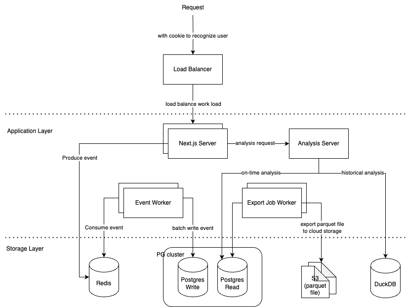
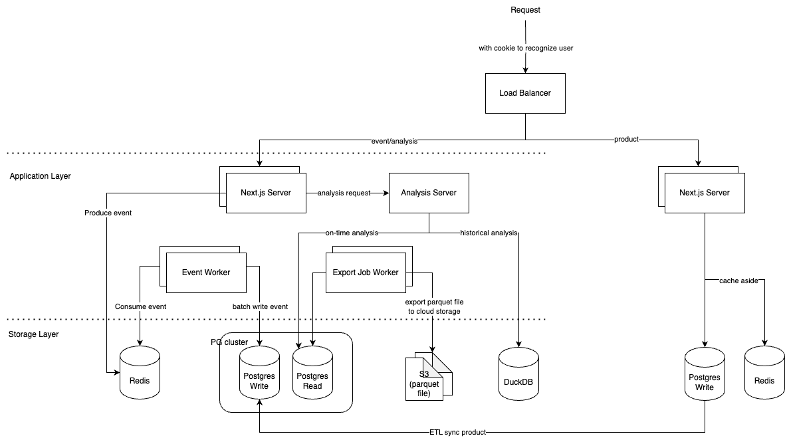

## Requirement
A system capable of handling a large volume of events, with real-time result analysis. Daily traffic: 1 billion events.

## System Analysis
1. request/sec : 12000
2. event size: 2kb (around 2000 characters)

24MB per sec. 
1min = 24 * 60 = 1440MB
10min = 24 * 60 * 10 = 14400MB = 14.4GB
1 day = 14.4 * 6 * 24 = 2.0736TB
1 month = 2.0736 * 30 = 62.208TB

---
## High level design, 
we should consider the following points:
- server should be stateless and the respond time should be fast
    - should use a buffer between server and database to reduce the database write pressure
- database read/write separation
    - exporting/analysis job will be long query, we should separate it from write database
- data aggregation & export & object storage
    - we can use cloud object storage to store our aggregated data. like AWS S3, GCP Storage, Azure Blob Storage
    - we can export data per 10min and the file format should be parquet.
- real-time analysis
    - we could leverage some OLAP database like DuckDB to do real-time analysis. The performance is good enough and can be host by our server.
    DuckDB also support import/export data from/to cloud storage and support multiple format(parquet, csv, etc.).

Here is a high level design diagram:

### Buffer between server and database
Consider to the request volume, we must add a buffer between server and database to reduce the database write pressure.
We can use a simple in-memory queue to buffer the request at first then switch to redis.
Redis has a good performance and can handle the request volume. Redis also support persistence and the data lost is within one sec.
When scaling, we can either pair a redis with a k8s node or use redis cluster to scale the service. 
For data structure, we can use multiple `List` to buffer requests. Like `event_{timestamp}`

IMO, I don't think we need kafka in this case because we don't need the feature of kafka, like stream processing, multiple consumer, etc.

### Database (as raw data storage)
I'll choose PostgreSQL for this case because it's the most popular and I familiar with. We still need a database to store raw data.
To avoid the performance issue when doing analysis query, we should separate the database to read and write. To speed up the query
To reduce the cost, and keep/improve the performance for analysis, we can pre-aggregate the data in the database. then export the raw data into Cloud storage after a period of time.

### Analysis
---
There are two scenario for analysis job:
1. analysis the data stored in the cloud storage(for analysis historical data)
2. directly analysis in the database(for on-time data)

1. **analysis the data stored in the cloud storage**
For analysis historical data, we can use the OLAP database like duckdb to do analysis. 
The benefit of using duckdb:
- better performance to do analysis query than PostgreSQL
- support import data from cloud storage
- support multiple export format(parquet, csv, etc.), no need to maintain our own export service.

There are two way to host the duckdb:
- host duckdb by our-self
    We can host the duckdb by our-self and import the data from cloud storage then do analysis.
    Pros:
    - we can do analysis fast and with volume data
    Cons:
    - need to maintain the duckdb service
    - data import and cold start takes time
- use mother-duck service
    We can use mother-duck service to do analysis.
    Pros:
    - no need to maintain the duckdb service
    Cons:
    - cost more 
    - data transfer cost
    - limited by the service API

2. **directly analysis in the database**
For on-time data, we can directly analysis in the database(read only).
Since we've done the database read/write separation, we can analysis the data in the database without affecting the performance. and with pre-aggregate data, the performance should be good enough.

Pros:
- no need to export data from database
- no need to maintain the duckdb service
- cost less(no service cost, no data transfer cost)
- no need to wait before analysis
Cons:
- the performance might not as good as using duckdb

### AB Testing
There are two topic we can discuss about AB testing:
1. **how to assign the user to different test and get consistent result**

1.1 How to assign the user to different test
We can use different strategies to assign the user to different test and it's based on the business goals.
For example, 
1. we can use the hash of the user id.
2. we can use the round-robin method.
3. we can assign the user by the time they login.
4. we can use the random method.

The assign strategy should be extendable so we should design the system in a way that we can add new assign strategy in the future without modifying the existing logic.

1.2 How to get consistent result
We can use the cookie or session to memorize the test name.
There are trade-off between cookie and session:
- cookie
    - control by the browser, the user can clear the cookie.
    - wont increase the server's workload.
    - store in the browser, won't increase the server's storage cost.
    - easy to implement, no need to maintain the session server.
    - cookie have a size limit 4kb
- session
    - control by the server, the server can clear the session/delete the cookie.
    - will increase the server's workload.
    - will increase the server's storage cost.
    - Can implement complex logic and won't have size limit
    - Should persist the session data in the database.
    - scale up could be hard for a distributed server.
IMO, the testing info is not sensitive and the info won't be large. We can use the cookie to implement this feature.
    
2. **how to create & store a test**
If the page content user saw should be delivered by us. We should reduce the risk of single point failure.
The architecture might be like this:

The benefit of this architecture is that if the event's database is down, the A/B testing service still can work. The incident will have a smaller effect.
But we will not have the strong consistency between the product and the event's database. and we'll have to use a ETL tool to sync the product's info into the event's database. It might cause some latency and extra cost.

If we like to reduce the latency of getting page content or reduce the workload of the product's database. We could add a cache layer(like Redis) to cache the page content, we could use a cache aside pattern to achieve this.

---
## Others
There are another future benefit of using duckdb.
There is a OSS project called "WrenAI" which is a text-to-sql tool. It can convert the natural language to the sql query and do analysis.
But it only support RDBMS(PostgreSQL, MySQL, etc.) and duckdb for now.
Maybe it will be a good idea to let WrenAI to analyze the data in duckdb in the future.

There are some point we can consider 
- Is LLM good enough to generate analytic sql?
- Is WrenAI OSS version production ready?